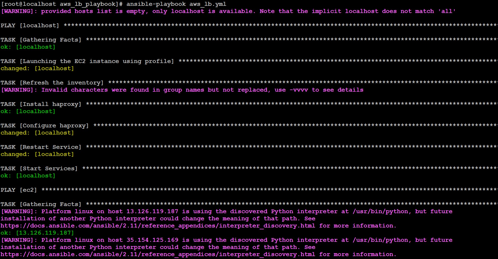

<b><i>
# ***Configuring the Haproxy Load Balancer and Apache Webserver on top of AWS using ansible***

>## ***Task Description:***
1. Provision EC2 instances through ansible.
2. Retrieve the IP Address of instances using the dynamic inventory concept.
3. Configure the web servers through the ansible role.
4. Configure the load balancer through the ansible role.
5. The target nodes of the load balancer should auto-update as per the status of web servers.

***So basically here also we are going to do the same setup as we did in the [previous task]((https://github.com/Gaurav-2001/LW-Arth-Task-12-1) but now on top of AWS cloud with the use of Dynamic inventory***

>## ***Perquisites we need in CN along with ansible:***
1. AWS’s IAM account with its authentication details
2. Software and Libraries needed :
   * Boto Library (Further I have explained how to install)
   * Boto3 Library


### Now let’s Begin...

1. As we are going to use the dynamic inventory for this task so we need to download the ec2.py and ec2.ini file and do some Configuration in it. After the files run they give a JSON output (IP's) which ansible grabs and does its task

```
wget https://raw.githubusercontent.com/ansible/ansible/stable-2.9/contrib/inventory/ec2.py

wget https://raw.githubusercontent.com/ansible/ansible/stable-2.9/contrib/inventory/ec2.ini
```

2. The file ec2.py is made on top of python2 and we have python3 so we need to change the hash-bang on the code from #!/usr/bin/python2 ⇒ #!/usr/bin/python3

<p align="center">

</p>

3. We also need to make these files executable by running the following commands

```
chmod +x ec2.py

chmod +x ec2.ini
```

4. Now as we are going to use AWS to launch the EC2-instances so we need to authenticate ourselves in AWS CLI. for this first download and install awscli with `pip install awscli` Now to set our authentication details use `aws configure`

5. Now our setup for the Dynamic inventory is done now let’s move towards the playbook. for this first, let’s create our workspace in my case I created in `/root/main_ws/ansible_ws/aws_lb_playbook` this will compromise all the important files and folders required and used in the playbook

<p align="center">

</p>

6. Now I have created the playbook which performs 3 major tasks i.e launches the EC2-instances using our profile we setup with awscli next the playbook configure a haproxy load balancer on top of our localhost further on top of the EC2-instances it launches the Webserver

7. In this part of the playbook, we will be Launching the EC2-instances using the ec2 module of ansible. further now we want our inventory to be refreshed with new hosts launched at the time we are running the playbook. so for this, we refreshed the inventory using meta module of ansible. next, we have configured the haproxy as discussed in the previous task ~ [here](https://github.com/Gaurav-2001/LW-Arth-Task-12-1)

```
- hosts: localhost
  vars_files:
          - "./vars/vars.yml"
  tasks:
          - name: 'Launching the EC2 instance using profile'
            ec2:
                    profile: '{{ profile }}'
                    image: '{{ ami_id }}'
                    count: '{{ count }}'
                    assign_public_ip: '{{ public_ip_need }}'
                    instance_type: '{{ instance_type }}'
                    state: present
                    wait: 'yes'
                    vpc_subnet_id: '{{ subnet_id }}'
                    group_id: '{{ security_group_id }}'
                    region: '{{ region }}'
                    key_name: '{{ key }}'
                    instance_tags:
                            env: "web"
                            Name: "web-backend-server"

          - name: "Refresh the inventory"
            meta: refresh_inventory

          - name: "Install haproxy"
            package:
                    name: "haproxy"
                    state: present

          - name: "Configure haproxy"
            template:
                    src: "./template/haproxy.cfg"
                    dest: "/etc/haproxy/haproxy.cfg"
            register: lb_conf

          - name: "Restart Service"
            service:
                    name: "haproxy"
                    state: restarted
            when: lb_conf.changed == true

          - name: "Start Services"
            service:
                    name: "haproxy"
                    state: started
```

8. Now in this section on top of those inventories we launched, we are going to configure the Webserver. using the same approach we used in our previous task ~ [here](https://github.com/Gaurav-2001/LW-Arth-Task-12-1)

```

- hosts: ec2
  vars_files:
          - "./vars/vars.yml"
  tasks:
          - name: "Install httpd"
            package:
                    name: "httpd"
                    state: present

          - name: "Install php"
            package:
                    name: "php"
                    state: present

          - name: "Configure the httpd"
            template:
                    src: "./template/gaurav.conf"
                    dest: "/etc/httpd/conf.d/gaurav.conf"
            register: web_conf

          - name: "Create folder"
            file:
                    state: directory
                    path: "{{ doc_root }}"

          - name: "Restart Services"
            service:
                    name: "httpd"
                    state: restarted
            when: web_conf.changed == true

          - name: "Start services"
            service:
                    name: "httpd"
                    state: started

          - name: "Copy the web pages"
            copy:
                    src: "./copy/index.php"
                    dest: "{{ doc_root }}/index.php"
```

9. The Variables used in the playbook are been imported from the `vars/vars.yml` file

<p align="center">

</p>

10. Now its time to run the playbook for this use the command `#ansible-playbook aws_lb.yml`

<p align="center">

</p>

<p align="center">

</p>

11. Now let’s check our setup is done successfully or not. for this let’s check at the most from the AWS portal launched instances.

<p align="center">

</p>

<p align="center">

</p>

12. Now lets check the localhost IP and try to connect it at port 8081 and see wheater they are doing loadbalancing for the Webservers or not properly

<p align="center">

</p>

<p align="center">

</p>

<p align="center">

</p>

### ***We have successfully done the whole setup. So now our task is completed :) 🙌***

### ***Thanks for reading***
### ***Any query and suggestion are always welcome- [Gaurav Pagare](https://www.linkedin.com/in/gaurav-pagare-8b721a193/)***
